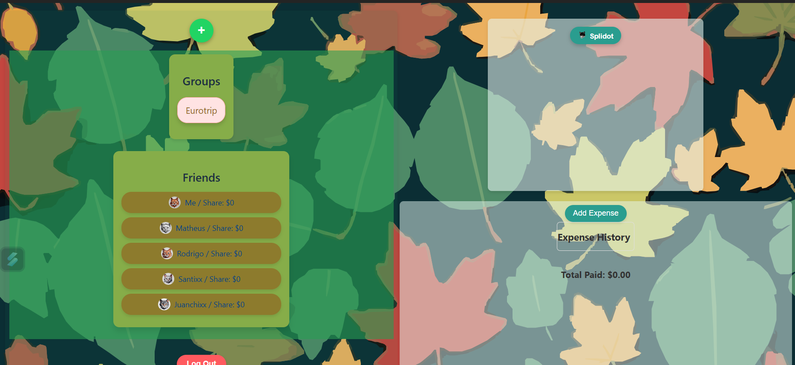

# Splidot

Splidot is a user-friendly payment manager designed to help you split expenses among friends effortlessly. With Splidot, you can create groups, add expenses, and have the app calculate equal splits for everyone. The app ensures transparency and ease of managing shared costs.



---

## Getting Started

### Prerequisites
To run Splidot locally, you need:
- Node.js (v16+ recommended)
- PostgreSQL database
- A package manager like npm or yarn

### Installation

1. Clone the repository:
   ```bash
   git clone 'https://github.com/Rov95/splidot.git'
   cd splidot
   ```

2. Install dependencies for both the frontend and backend:
   ```bash
   # Install frontend dependencies
   cd client
   npm install

   # Install backend dependencies
   cd ../server
   npm install
   ```

3. Configure the environment variables:
   - For the backend, create a `.env` file in the `server` directory with the following:
     ```env
     DATABASE_URL=postgresql://<user>:<password>@localhost:5432/splidot
     PORT=5000
     SESSION_SECRET=<your-secret-key>
     ```
   

### Running the Application

1. Start the backend server:
   ```bash
   cd server
   npm run dev
   ```

2. Start the frontend development server:
   ```bash
   cd ../client
   npm run dev
   ```

3. Open your browser and navigate to `http://localhost:3000` to use Splidot.

---

## Tech Stack

### Frontend
- **Framework:** React with Vite for fast development and build performance
- **Styling:** CSS for responsive and modern design

### Backend
- **Framework:** Node.js with Express for building the server and API
- **Database:** PostgreSQL for robust and scalable data management
- **ORM:** Sequelize for managing database models and queries
- **Authentication:** Session-based authentication for secure user sessions

---

## Contributors

Splidot was developed by:
- **[Andres Menco](https://github.com/Rov95)** - Full-stack development

Contributions, bug reports, and feature requests are welcome! Feel free to open an issue or submit a pull request on [GitHub](https://github.com/Rov95/splidot.git).

---


